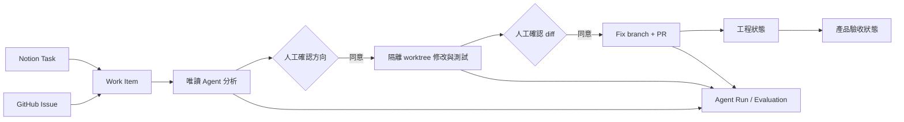

# Traceboard

Traceboard 是一個 Notion × GitHub 的 Agent 工作控制台。它不取代 Coding Agent，而是把產品任務、工程證據、人工授權、隔離修復、PR 與驗收狀態串成可追蹤的 Work Item。

> 核心問題：PR merged 不等於產品完成；Agent 能修改程式，也不代表它應該在沒有授權與評測的情況下修改。

## 5 分鐘 Demo

1. 在 GitHub 建立一個有明確重現方式的小型 Bug Issue。
2. 在 Traceboard 按「匯入 Issue」，確認後建立對應 Notion Task 與 Work Item。
3. 點選 Task，讓 Agent 以唯讀方式分析 repository context。
4. 檢查根因、修改檔案、驗證方式與風險；人工確認後才建立隔離 worktree。
5. 檢視實際 diff 與測試結果，再次確認後推送 fix branch 並建立 PR。
6. 在「Agent 評測」查看執行成功率、PR 產生率、耗時與可重現的狀態判斷基準測試。
7. 合併 PR 後重新同步：工程狀態完成，但 Notion 仍保留獨立的產品驗收狀態。

完整講稿與失敗備案見 [`docs/INTERVIEW_DEMO.md`](docs/INTERVIEW_DEMO.md)。

## 核心流程



## 面試可討論的設計決策

- **統一識別**：Notion Task、GitHub Issue、PR 名稱可能不同，由 Work Item 保存穩定對應。
- **狀態分離**：`engineeringStatus` 與 `acceptanceStatus` 分開，避免 merge 被誤判為產品驗收。
- **Human-in-the-loop**：分析與寫入分離；修改方向和實際 diff 各需要一次確認。
- **最小權限**：分析階段唯讀；修復只允許已確認檔案，並在隔離 worktree 執行。
- **可觀測性**：記錄結構化 Agent Run，不保存 Token、完整 Prompt 或 Diff。
- **可評測性**：固定狀態案例避免規則回歸；真實 Run 衡量測試、PR、人工接受與耗時。

## 技術架構

- Next.js-compatible React application（Vinext / Cloudflare runtime）
- Notion API：Task source of truth 與產品驗收
- GitHub API：Issue、PR、review、CI 證據與分支推送
- OpenAI Responses API：結構化唯讀分析與工作摘要
- Cloudflare D1 + Drizzle ORM：Work Item 與 Agent Run
- Local fix runner：隔離 worktree、檔案範圍限制、測試、diff preview

## 本機執行

需求：Node.js 22.13+

```bash
npm install
cp .env.example .env.local
npm run dev
```

最小設定為 `NOTION_TOKEN`、`NOTION_DATA_SOURCE_ID`。要執行 Agent 修復與 PR，還需要 `OPENAI_API_KEY` 與具備 repository Contents、Issues、Pull requests read/write 權限的 `GITHUB_TOKEN`。

```bash
npm run lint
npm test
```

## 安全邊界

- GitHub、Notion 內容視為不可信輸入，不作為 Agent 指令。
- Token 僅存於 `.env.local`，不得提交版本控制。
- Agent 不直接在主工作目錄或預設分支修改。
- 只有低風險、少量檔案、具明確驗證方式的工作可進入自動修復候選。
- 最終合併與產品驗收仍由人決定。

## 已知限制

- 目前是單人本機工作流，尚未處理多租戶與雲端 runner 隔離。
- GitHub → Notion 同步目前由使用者觸發，尚未接 webhook。
- 評測資料量仍小；Run metrics 不能代表模型在一般軟體任務上的整體能力。
- 規則基準測試驗證狀態推理，不等同於端到端 Agent 修復成功率。
